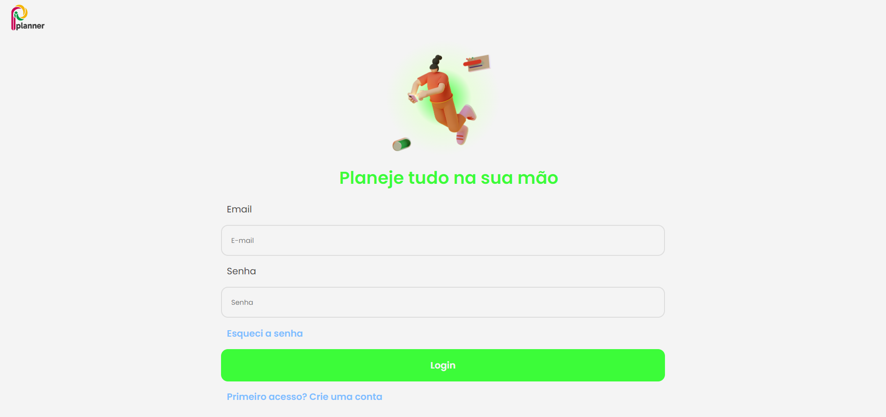
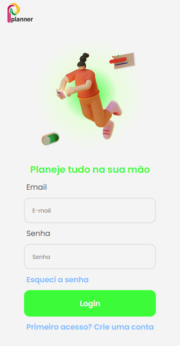

# 👩‍💻 Projeto Treino Front-end | New Go

Projeto de treino de implementação de telas figmas em código.

## 📌 Skills utilizadas
- Javascript
- HTML
- CSS

## 💻 Telas

### Planner:
O planner é uma plataforma de gerenciament de tarefas. Suas telas foram implementadas para _desktop_ e _mobile_.
#### Exemplo da página de Login desktop/mobile:
 
